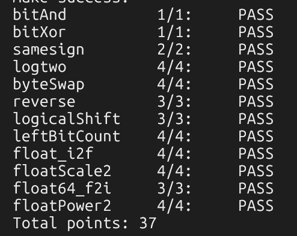

# datalab 报告

姓名：Li2O0577

学号：2025201690

| 总分 | bitAnd | bitXor | samesign | logtwo | byteSwap | reverse | logicalShift | leftBitCount | float_i2f | floatScale2 | float64_f2i | floatPower2 |
| --------- | ------------- | ------------- | ------------- | ------------- | ------------- | ------------- | ------------- | ------------- | ------------- | ------------- | ------------- | ------------- |
| 37.00 | 1.00 | 1.00 | 2.00 | 4.00 | 4.00 | 3.00 | 3.00 | 4.00 | 4.00 | 4.00 | 3.00 | 4.00 |


test 截图：




## 解题报告

### 亮点

1. logtwo
2. leftBitCount
3. byteSwap
4. float_i2f

### bitAnd

```c
int bitAnd(int x, int y) {
    return ~(~x | ~y);
}
```

用德摩根律：`~x | ~y` 等于 `~(x & y)`，再取一次反就得到 `x & y`。

### bitXor

```c
int bitXor(int x, int y) {
    return ~(~x & ~y) & ~(x & y);
}
```

`x ^ y` 等于「至少有一个为 1，但不能两个都为 1」，即 `(x | y) & ~(x & y)`。题目只允许 `~` 和 `&`，所以再用德摩根律把 `x | y` 写成 `~(~x & ~y)`。共 7 个运算符，刚好卡在上限。

### samesign

```c
int samesign(int x, int y) {
    if (!x && !y)
        return 1;
    if ((!x) ^ (!y))
        return 0;
    return !((x >> 31) ^ (y >> 31));
}
```

分三种情况：两个都是 0 时同号；只有一个为 0 时不同号（用 `(!x) ^ (!y)` 判断“恰好一个为 0”）；都非 0 时比较符号位 `x >> 31` 和 `y >> 31`，相同则同号。

### logtwo

```c
int logtwo(int v) {
    int r = 0;
    int t, u;

    t = (v >> 16) > 0;  u = t << 4;  r = r | u;  v = v >> u;
    t = (v >> 8)  > 0;  u = t << 3;  r = r | u;  v = v >> u;
    t = (v >> 4)  > 0;  u = t << 2;  r = r | u;  v = v >> u;
    t = (v >> 2)  > 0;  u = t << 1;  r = r | u;  v = v >> u;
    t = (v >> 1)  > 0;  r = r | t;

    return r;
}
```

求最高位 1 的位置，用二分：先看高 16 位有没有 1，有就把 16 计入并把 v 右移 16；再依次判断 8、4、2、1。因为不允许 `if`，把比较结果（0/1）当作移位量来实现“条件执行”。

### byteSwap

```c
int byteSwap(int x, int n, int m) {
    int nb = n << 3;
    int mb = m << 3;
    int b1 = (x >> nb) & 0xFF;
    int b2 = (x >> mb) & 0xFF;
    int mask = ~((0xFF << nb) | (0xFF << mb));

    return (x & mask) | (b1 << mb) | (b2 << nb);
}
```

第 n 个字节对应第 `n*8` 位，所以先算出两个位移量。分别取出两个字节，再用掩码把这两个字节的位置清零，最后把两个字节交换后放回去。

### reverse

```c
unsigned reverse(unsigned v) {
    unsigned r = 0;
    int i = 32;

    while (i) {
        r = (r << 1) | (v & 1);
        v = v >> 1;
        i = i - 1;
    }

    return r;
}
```

循环 32 次，每次取 `v` 的最低位拼到 `r` 的末尾，`r` 左移给下一位腾位置。这样第 0 位跑到第 31 位，整体位序反转。因为 v 是 unsigned，`>>` 是逻辑右移。

### logicalShift

```c
int logicalShift(int x, int n) {
    int p = (1 << 31) >> n;
    int mask = ~(p << 1);

    return (x >> n) & mask;
}
```

有符号 `>>` 是算术右移，负数会补 1。先构造“高 n 位为 0”的掩码，再用它把算术右移多补出来的 1 清掉，得到逻辑右移的效果。

### leftBitCount

```c
int leftBitCount(int x) {
    int y = ~x;
    int z = !y;
    int n = 0;
    int t;

    t = !(y >> 16);  n = n + (t << 4);  y = y << (t << 4);
    t = !(y >> 24);  n = n + (t << 3);  y = y << (t << 3);
    t = !(y >> 28);  n = n + (t << 2);  y = y << (t << 2);
    t = !(y >> 30);  n = n + (t << 1);  y = y << (t << 1);
    t = !(y >> 31);  n = n + t;

    return n + z;
}
```

「x 开头连续 1 的个数」等于「`~x` 开头连续 0 的个数」。对 `~x` 用二分数前导 0：先看高 16 位是否全 0，是就加 16 并左移；再 8、4、2、1。`x = -1` 时 `~x = 0`，二分只能数到 31，用 `z = !y` 补上第 32 位。

### float_i2f

```c
unsigned float_i2f(int x) {
    unsigned sign, mag, frac, drop;
    int e = 31;
    int rnd = 0;

    if (x == 0)
        return 0;
    sign = x & 0x80000000;
    if (sign)
        mag = -x;
    else
        mag = x;
    while (!(mag & 0x80000000)) {
        mag = mag << 1;
        e = e - 1;
    }
    frac = (mag >> 8) & 0x7FFFFF;
    drop = mag & 0xFF;
    if (drop > 0x80)
        rnd = 1;
    else if (drop == 0x80) {
        if (frac & 1)
            rnd = 1;
    }
    if (rnd) {
        frac = frac + 1;
        if (frac & 0x800000) {
            frac = frac & 0x7FFFFF;
            e = e + 1;
        }
    }
    return sign | ((e + 127) << 23) | frac;
}
```

先取出符号位和绝对值，然后左移直到最高位对齐，确定阶码 e。尾数取 23 位，低 8 位用于舍入：大于 0x80 进位，等于 0x80 时按“就近取偶”看尾数末位。尾数进位若溢出则阶码加 1。

### floatScale2

```c
unsigned floatScale2(unsigned uf) {
    unsigned exp = (uf >> 23) & 0xFF;
    unsigned sign = uf & 0x80000000;

    if (exp == 0xFF)
        return uf;
    if (exp == 0)
        return sign | (uf << 1);
    return uf + 0x800000;
}
```

分三种情况：NaN / Inf 直接返回；非规格化数（exp 为 0）整体左移一位实现乘 2，符号位单独保留；规格化数阶码加 1 即可。

### float64_f2i

```c
int float64_f2i(unsigned uf1, unsigned uf2) {
    unsigned sign = uf2 >> 31;
    int exp = (uf2 >> 20) & 0x7FF;
    int E;
    unsigned hi, lo, res;
    int s;

    if (exp >= 0x7FF)
        return 0x80000000;
    if (!exp)
        return 0;
    E = exp - 1023;
    if (E < 0)
        return 0;
    if (E > 30)
        return 0x80000000;
    hi = (1 << 20) | (uf2 & 0xFFFFF);
    lo = uf1;
    s = 52 - E;
    if (s >= 32)
        res = hi >> (s - 32);
    else
        res = (hi << (32 - s)) | (lo >> s);
    if (sign)
        res = -res;
    return res;
}
```

把 64 位 double 拆成符号、阶码、尾数（高 20 位 + 低 32 位）。阶码为 0（下溢）或实际指数为负时结果为 0；指数过大时溢出返回 0x80000000。否则把 53 位有效数字按阶码移位，截断小数部分实现向零取整，最后补上符号。

### floatPower2

```c
unsigned floatPower2(int x) {
    if (x > 127)
        return 0x7F800000;
    if (x >= -126)
        return (x + 127) << 23;
    if (x >= -149)
        return 1 << (x + 149);
    return 0;
}
```

分四种情况：指数大于 127 上溢为正无穷；`-126 ~ 127` 是规格化数，阶码字段为 `x + 127`；`-149 ~ -127` 是非规格化数，尾数只有一位 1，位置为 `x + 149`；再小则返回 0。

## 反馈/收获/感悟/总结

这里我想先说一下我学到的总体思路，那就是在很多操作中我们都需要去在特定位置上产生一和零。那么我从中学习到了可以将位运算和加减的操作相结合，从而实现任意一个位置，任意长度的一的实现。然后就是一些二分算法让我体会比较深刻，可以通过一步一步等价的操作实现字节层面上的统计之类的。此外，我觉得非常有意思的一点是，可以通过判断语句和位运算的联合，自己去造一个伪 if else。

## 参考的重要资料

无
